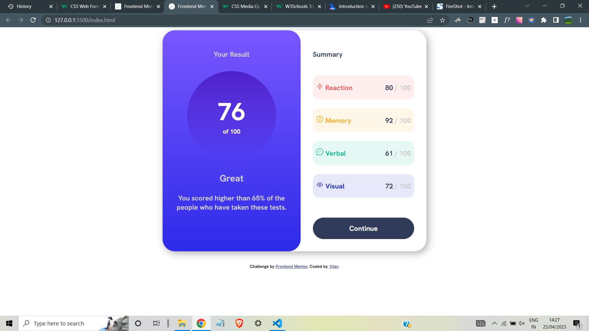
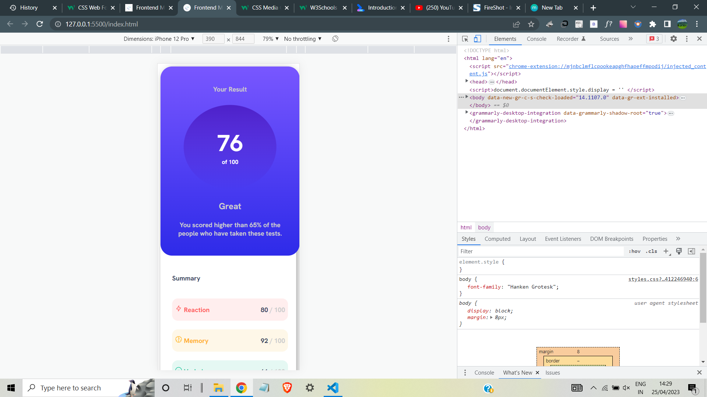
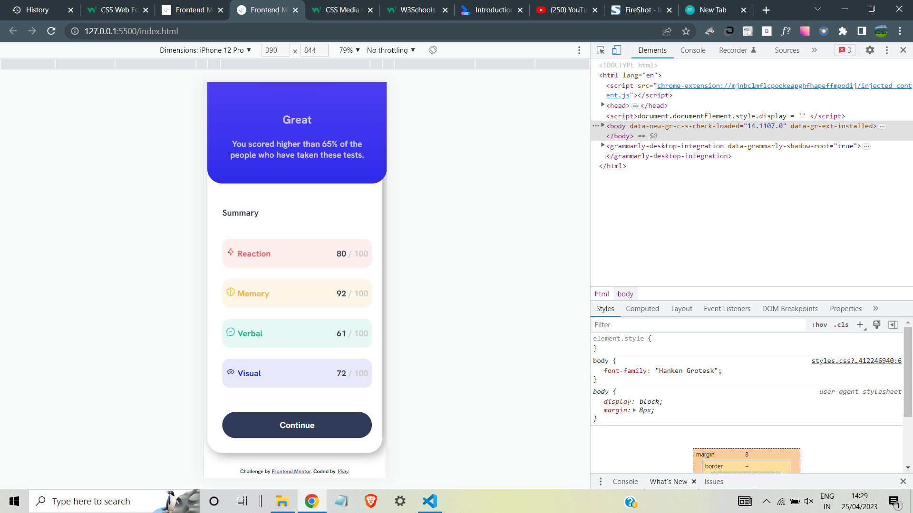

# Frontend Mentor - Results summary component solution

This is a solution to the [Results summary component challenge on Frontend Mentor](https://www.frontendmentor.io/challenges/results-summary-component-CE_K6s0maV). Frontend Mentor challenges help you improve your coding skills by building realistic projects.

## Table of contents

- [Overview](#overview)
  - [Screenshot](#screenshot)
- [My process](#my-process)
  - [Built with](#built-with)
  - [Continued development](#continued-development)
  - [Useful resources](#useful-resources)
- [Author](#author)

### Screenshot

## Desktop view

## Mobile view

## My process

- The HTML and all needed to style the page was provided with.We have to complete the css part alone.

### Built with

- Semantic HTML5 markup
- CSS custom properties
- Flexbox

### Continued development

I did this entirely using simple html and css.If you have to reuse it you can write it as a react component.

### Useful resources

- [Primary resource for web devs](https://www.w3schools.com) -

## Author

- Frontend Mentor - [@Vijay S V](https://www.frontendmentor.io/profile/Vijay13899)
